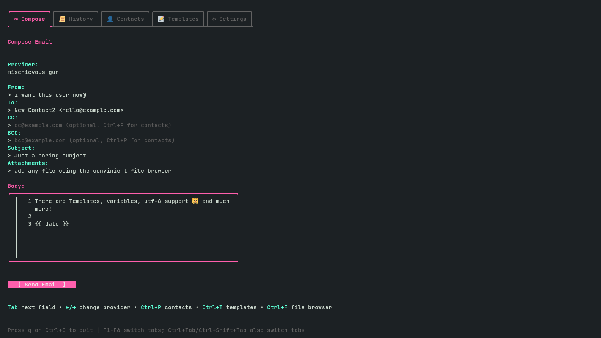

# MailGloss

A terminal-based email client built with Go and Bubble Tea, supporting multiple email providers.



## Features

- **Multiple Email Providers**: Support for Mailgun, SMTP, and SendGrid
- **Terminal UI**: Clean, interactive interface powered by Bubble Tea
- **Email Composition**: Compose and send emails with attachments
- **History Tracking**: Keep track of sent emails
- **Configuration Management**: Easy YAML-based configuration
- **Provider Switching**: Switch between multiple configured email providers

## Installation

### From Source

```bash
go build -o mailgloss
./mailgloss
```

## Configuration

MailGloss uses a YAML configuration file located at `~/.config/mailgloss/config.yaml`.

### Initial Setup

1. Copy the example configuration:
```bash
mkdir -p ~/.config/mailgloss
cp config.example.yaml ~/.config/mailgloss/config.yaml
```

2. Edit the configuration file with your email provider details:
```bash
nano ~/.config/mailgloss/config.yaml
```

### Configuration Options

#### Default Provider
```yaml
default_provider: "my-mailgun"
```

#### Provider Configurations

**Mailgun:**
```yaml
providers:
  my-mailgun:
    name: "my-mailgun"
    type: mailgun
    from_address: "your@email.com"
    from_name: "Your Name"
    mailgun:
      api_key: "your-mailgun-api-key"
      domain: "your-domain.com"
      url: "https://api.mailgun.net"
```

**SMTP:**
```yaml
providers:
  my-smtp:
    name: "my-smtp"
    type: smtp
    from_address: "your@email.com"
    from_name: "Your Name"
    smtp:
      host: "smtp.gmail.com"
      port: 587
      username: "your@email.com"
      password: "your-app-password"
```

**SendGrid:**
```yaml
providers:
  my-sendgrid:
    name: "my-sendgrid"
    type: sendgrid
    from_address: "your@email.com"
    from_name: "Your Name"
    sendgrid:
      api_key: "your-sendgrid-api-key"
```

#### Application Limits

```yaml
limits:
  max_attachment_size_mb: 25    # Maximum attachment size in MB
  max_history_entries: 100      # Maximum number of emails to keep in history
  max_body_length: 10000        # Maximum email body length in characters
  max_emails_per_field: 500     # Maximum character limit for To/CC/BCC fields
```

## Usage

Run MailGloss:
```bash
./mailgloss
```

### Interface Navigation

The application has three main tabs:
- **Compose**: Create and send new emails
- **History**: View previously sent emails
- **Settings**: Manage providers and application settings

## Project Structure

```
mailgloss/
├── config/         # Configuration loading and management
├── logger/         # Logging utilities
├── mailer/         # Email sending logic
├── models/         # Application models (compose, history, settings)
├── storage/        # History storage
├── ui/             # UI styles and components
└── main.go         # Application entry point
```

## Dependencies

- [Bubble Tea](https://github.com/charmbracelet/bubbletea) - TUI framework
- [Bubbles](https://github.com/charmbracelet/bubbles) - TUI components
- [Lipgloss](https://github.com/charmbracelet/lipgloss) - Style definitions
- [go-mail](https://github.com/ainsleyclark/go-mail) - Email sending library

## Requirements

- Go 1.25.7 or higher

## License

See LICENSE file for details.
